<div align="center">

# Cozy Pixel

**温暖像素世界 — 星露谷田园感 × 魔法微光**

**Warm pixel art SVG collection — Stardew Valley vibes with a touch of magic**

<p>
  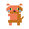  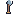 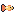 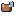 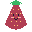    
</p>

[](https://developer.mozilla.org/en-US/docs/Web/SVG) [](#gallery) [](#animated) [](#palette) [](LICENSE)

<details><summary><b>📍 Quick Nav</b></summary><br>

🔥 [Animated Icons](#animated) · 🌾 [Cozy Pixel Style](#cozy-style) · 🐾 [Cute Characters](#cute-characters) · 🐧 [Animals](#animals) · 🐙 [Ocean Life](#ocean-life) · 😊 [Emoji Faces](#emoji-faces) · 🍓 [Fruits](#fruits) · 🍡 [Food & Drinks](#food--drinks) · 🗡️ [Items & Gems](#items--gems) · 🌿 [Nature & Scenes](#nature--scenes) · 🌤️ [Weather](#weather) · 🏎️ [Vehicles](#vehicles) · ⚽ [Sports](#sports) · 🎵 [Music](#music) · 🎉 [Holidays](#holidays) · 🌸 [Flowers & Plants](#flowers--plants) · 🦄 [Fantasy](#fantasy) · 🔮 [Space & Magic](#space--magic) · 🎸 [Lifestyle](#lifestyle) · 🌏 [Cultures](#world-cultures) · ✨ [Mini](#mini-icons) · 🎨 [Palette](#palette)

</details>

</div>

---

<a id="animated"></a>

## 🔥 Animated Icons · 会动的像素画 <sub>12 icons</sub>

> 开源领域首个**动画像素风 SVG** 资源库。纯 CSS/SVG 动画，零 JS 依赖，单文件即用。
>
> The first open-source **animated pixel art SVG** library. Pure CSS/SVG animation, zero JS, self-contained.

<table>
  <tr>
    <td align="center"><br><sub><b>Heart</b><br>心跳脉冲</sub></td>
    <td align="center"><br><sub><b>Flame</b><br>火焰闪烁</sub></td>
    <td align="center"><br><sub><b>Ghost</b><br>幽灵飘浮</sub></td>
    <td align="center"><br><sub><b>Potion</b><br>药水冒泡</sub></td>
    <td align="center">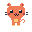<br><sub><b>Cat</b><br>猫咪眨眼</sub></td>
    <td align="center"><br><sub><b>Star</b><br>星星闪烁</sub></td>
  </tr>
  <tr>
    <td align="center"><br><sub><b>Gem</b><br>宝石闪光</sub></td>
    <td align="center"><br><sub><b>Jellyfish</b><br>水母脉动</sub></td>
    <td align="center"><br><sub><b>Shooting Star</b><br>流星划过</sub></td>
    <td align="center">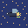<br><sub><b>Firefly</b><br>萤火虫</sub></td>
    <td align="center"><br><sub><b>Crystal</b><br>水晶闪烁</sub></td>
    <td align="center"><br><sub><b>Hourglass</b><br>沙漏流沙</sub></td>
  </tr>
</table>

> **Note:** 动画在 `<object>` 或直接打开 SVG 文件时播放。GitHub README 的 `` 标签会禁止动画，请用 `animated-preview.html` 在线预览完整动画效果。

<a id="cozy-style"></a>

## 🌾 Cozy Pixel Style · 舒适像素风 <sub>NEW</sub>

> **星露谷温暖感 + 魔法微光** — 1px 暗色轮廓 / 左上高光 / HARVEST-20 限定调色板 / 每个物品一颗微光
>
> Stardew Valley warmth + magic sparkle. Dark outlines, top-left highlights, 20-color palette.

<table>
  <tr>
    <td align="center"><br><sub><b>Turnip</b><br>萝卜</sub></td>
    <td align="center"><br><sub><b>Apple</b><br>红苹果</sub></td>
    <td align="center"><br><sub><b>Egg</b><br>鸡蛋</sub></td>
    <td align="center"><br><sub><b>Axe</b><br>斧头</sub></td>
    <td align="center"><br><sub><b>Watering Can</b><br>浇水壶</sub></td>
    <td align="center"><br><sub><b>Golden Fish</b><br>金鱼</sub></td>
  </tr>
</table>

> 完整风格规则见 [STYLE-GUIDE.md](STYLE-GUIDE.md) · 新旧对比见 `style-compare.html`

---

<a id="gallery"></a>

<a id="cute-characters"></a>

## 🐾 Cute Characters · 可爱角色

<table>
  <tr>
    <td align="center"><br><sub><b>Cat</b><br>猫咪</sub></td>
    <td align="center">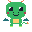<br><sub><b>Dragon</b><br>龙</sub></td>
    <td align="center"><br><sub><b>Robot</b><br>机器人</sub></td>
    <td align="center">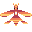<br><sub><b>Phoenix</b><br>凤凰</sub></td>
    <td align="center"><br><sub><b>Ghost</b><br>幽灵</sub></td>
    <td align="center">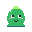<br><sub><b>Slime</b><br>史莱姆</sub></td>
  </tr>
  <tr>
    <td align="center">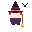<br><sub><b>Witch</b><br>女巫</sub></td>
    <td align="center">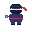<br><sub><b>Ninja</b><br>忍者</sub></td>
    <td align="center">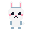<br><sub><b>Bunny</b><br>兔子</sub></td>
    <td align="center"><br><sub><b>Owl</b><br>猫头鹰</sub></td>
    <td align="center">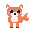<br><sub><b>Fox</b><br>狐狸</sub></td>
    <td align="center">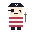<br><sub><b>Pirate</b><br>海盗</sub></td>
  </tr>
  <tr>
    <td align="center">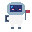<br><sub><b>Astronaut</b><br>宇航员</sub></td>
    <td align="center">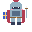<br><sub><b>Knight</b><br>骑士</sub></td>
    <td align="center">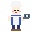<br><sub><b>Chef</b><br>厨师</sub></td>
    <td align="center"><br><sub><b>Scientist</b><br>科学家</sub></td>
    <td align="center"><br><sub><b>Firefighter</b><br>消防员</sub></td>
    <td align="center"><br><sub><b>Princess</b><br>公主</sub></td>
  </tr>
  <tr>
    <td align="center">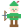<br><sub><b>Elf</b><br>精灵</sub></td>
    <td align="center">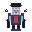<br><sub><b>Vampire</b><br>吸血鬼</sub></td>
    <td align="center">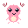<br><sub><b>Axolotl</b><br>六角恐龙</sub></td>
    <td align="center">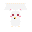<br><sub><b>Kitsune</b><br>九尾狐</sub></td>
  </tr>
</table>

<a id="animals"></a>

## 🐧 Animals · 动物世界

<table>
  <tr>
    <td align="center">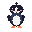<br><sub><b>Penguin</b><br>企鹅</sub></td>
    <td align="center">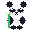<br><sub><b>Panda</b><br>熊猫</sub></td>
    <td align="center">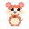<br><sub><b>Hamster</b><br>仓鼠</sub></td>
    <td align="center">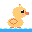<br><sub><b>Duckling</b><br>小黄鸭</sub></td>
    <td align="center">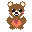<br><sub><b>Bear</b><br>小熊</sub></td>
    <td align="center">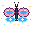<br><sub><b>Butterfly</b><br>蝴蝶</sub></td>
  </tr>
  <tr>
    <td align="center">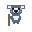<br><sub><b>Koala</b><br>考拉</sub></td>
    <td align="center">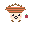<br><sub><b>Hedgehog</b><br>刺猬</sub></td>
    <td align="center"><br><sub><b>Frog</b><br>青蛙</sub></td>
    <td align="center">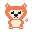<br><sub><b>Shiba Inu</b><br>柴犬</sub></td>
    <td align="center">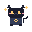<br><sub><b>Black Cat</b><br>黑猫</sub></td>
    <td align="center">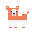<br><sub><b>Corgi</b><br>柯基</sub></td>
  </tr>
  <tr>
    <td align="center">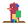<br><sub><b>Parrot</b><br>鹦鹉</sub></td>
    <td align="center">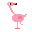<br><sub><b>Flamingo</b><br>火烈鸟</sub></td>
    <td align="center">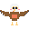<br><sub><b>Eagle</b><br>鹰</sub></td>
    <td align="center">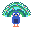<br><sub><b>Peacock</b><br>孔雀</sub></td>
    <td align="center">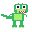<br><sub><b>T-Rex</b><br>霸王龙</sub></td>
    <td align="center">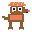<br><sub><b>Triceratops</b><br>三角龙</sub></td>
  </tr>
  <tr>
    <td align="center">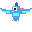<br><sub><b>Pterodactyl</b><br>翼龙</sub></td>
    <td align="center">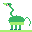<br><sub><b>Brontosaurus</b><br>雷龙</sub></td>
    <td align="center">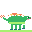<br><sub><b>Stegosaurus</b><br>剑龙</sub></td>
    <td align="center">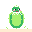<br><sub><b>Dino Egg</b><br>恐龙蛋</sub></td>
    <td align="center">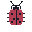<br><sub><b>Ladybug</b><br>瓢虫</sub></td>
    <td align="center">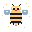<br><sub><b>Bee</b><br>蜜蜂</sub></td>
  </tr>
  <tr>
    <td align="center">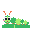<br><sub><b>Caterpillar</b><br>毛毛虫</sub></td>
    <td align="center"><br><sub><b>Dragonfly</b><br>蜻蜓</sub></td>
    <td align="center"><br><sub><b>Firefly</b><br>萤火虫</sub></td>
    <td align="center">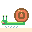<br><sub><b>Snail</b><br>蜗牛</sub></td>
    <td align="center">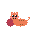<br><sub><b>Kitten</b><br>毛线猫</sub></td>
    <td align="center">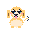<br><sub><b>Puppy</b><br>小狗</sub></td>
  </tr>
  <tr>
    <td align="center"><br><sub><b>Chick</b><br>小鸡</sub></td>
    <td align="center"><br><sub><b>Otter</b><br>水獭</sub></td>
    <td align="center"><br><sub><b>Alpaca</b><br>羊驼</sub></td>
    <td align="center"><br><sub><b>Red Panda</b><br>小熊猫</sub></td>
  </tr>
</table>

<a id="ocean-life"></a>

## 🐙 Ocean Life · 海洋生物

<table>
  <tr>
    <td align="center"><br><sub><b>Whale</b><br>鲸鱼</sub></td>
    <td align="center"><br><sub><b>Octopus</b><br>章鱼</sub></td>
    <td align="center"><br><sub><b>Jellyfish</b><br>水母</sub></td>
    <td align="center"><br><sub><b>Tropical Fish</b><br>热带鱼</sub></td>
    <td align="center"><br><sub><b>Seahorse</b><br>海马</sub></td>
    <td align="center"><br><sub><b>Crab</b><br>螃蟹</sub></td>
  </tr>
  <tr>
    <td align="center"><br><sub><b>Sea Turtle</b><br>海龟</sub></td>
    <td align="center"><br><sub><b>Dolphin</b><br>海豚</sub></td>
    <td align="center"><br><sub><b>Clownfish</b><br>小丑鱼</sub></td>
    <td align="center"><br><sub><b>Starfish</b><br>海星</sub></td>
    <td align="center"><br><sub><b>Pufferfish</b><br>河豚</sub></td>
    <td align="center"><br><sub><b>Anglerfish</b><br>鮟鱇鱼</sub></td>
  </tr>
  <tr>
    <td align="center"><br><sub><b>Narwhal</b><br>独角鲸</sub></td>
  </tr>
</table>

<a id="emoji-faces"></a>

## 😊 Emoji Faces · 表情包

<table>
  <tr>
    <td align="center"><br><sub><b>Happy</b><br>开心</sub></td>
    <td align="center"><br><sub><b>Love</b><br>花痴</sub></td>
    <td align="center"><br><sub><b>Cool</b><br>墨镜</sub></td>
    <td align="center"><br><sub><b>Sleepy</b><br>困困</sub></td>
    <td align="center"><br><sub><b>Angry</b><br>生气</sub></td>
    <td align="center"><br><sub><b>Surprise</b><br>惊讶</sub></td>
  </tr>
</table>

<a id="fruits"></a>

## 🍓 Fruits · 可爱水果

<table>
  <tr>
    <td align="center"><br><sub><b>Strawberry</b><br>草莓</sub></td>
    <td align="center"><br><sub><b>Watermelon</b><br>西瓜</sub></td>
    <td align="center"><br><sub><b>Peach</b><br>桃子</sub></td>
    <td align="center"><br><sub><b>Pineapple</b><br>菠萝</sub></td>
    <td align="center"><br><sub><b>Avocado</b><br>牛油果</sub></td>
    <td align="center"><br><sub><b>Lemon</b><br>柠檬</sub></td>
  </tr>
</table>

<a id="food--drinks"></a>

## 🍡 Food & Drinks · 美食饮品

<table>
  <tr>
    <td align="center"><br><sub><b>Boba Tea</b><br>奶茶</sub></td>
    <td align="center"><br><sub><b>Sushi</b><br>寿司</sub></td>
    <td align="center"><br><sub><b>Cake</b><br>蛋糕</sub></td>
    <td align="center"><br><sub><b>Ramen</b><br>拉面</sub></td>
    <td align="center"><br><sub><b>Ice Cream</b><br>冰淇淋</sub></td>
    <td align="center"><br><sub><b>Donut</b><br>甜甜圈</sub></td>
  </tr>
  <tr>
    <td align="center"><br><sub><b>Pizza</b><br>披萨</sub></td>
    <td align="center"><br><sub><b>Taco</b><br>卷饼</sub></td>
    <td align="center"><br><sub><b>Dumpling</b><br>饺子</sub></td>
    <td align="center"><br><sub><b>Waffle</b><br>华夫饼</sub></td>
    <td align="center"><br><sub><b>Hotdog</b><br>热狗</sub></td>
    <td align="center"><br><sub><b>Fried Egg</b><br>煎蛋</sub></td>
  </tr>
  <tr>
    <td align="center"><br><sub><b>Cupcake</b><br>杯子蛋糕</sub></td>
    <td align="center"><br><sub><b>Candy</b><br>棒棒糖</sub></td>
    <td align="center"><br><sub><b>Juice</b><br>果汁盒</sub></td>
    <td align="center"><br><sub><b>Cookie</b><br>曲奇</sub></td>
    <td align="center"><br><sub><b>Milkshake</b><br>奶昔</sub></td>
    <td align="center"><br><sub><b>Pudding</b><br>布丁</sub></td>
  </tr>
  <tr>
    <td align="center"><br><sub><b>Macaron</b><br>马卡龙</sub></td>
    <td align="center"><br><sub><b>Chocolate</b><br>巧克力</sub></td>
    <td align="center"><br><sub><b>Bubble Tea</b><br>芋泥奶茶</sub></td>
    <td align="center"><br><sub><b>Popsicle</b><br>冰棍</sub></td>
    <td align="center"><br><sub><b>Cotton Candy</b><br>棉花糖</sub></td>
    <td align="center"><br><sub><b>Honey</b><br>蜂蜜罐</sub></td>
  </tr>
  <tr>
    <td align="center"><br><sub><b>Coffee</b><br>咖啡</sub></td>
    <td align="center"><br><sub><b>Matcha</b><br>抹茶</sub></td>
    <td align="center"><br><sub><b>Pancake</b><br>松饼</sub></td>
    <td align="center"><br><sub><b>Cinnamon Roll</b><br>肉桂卷</sub></td>
    <td align="center"><br><sub><b>Toast</b><br>吐司</sub></td>
  </tr>
</table>

<a id="items--gems"></a>

## 🗡️ Items & Gems · 物品宝石

<table>
  <tr>
    <td align="center"><br><sub><b>Sword</b><br>宝剑</sub></td>
    <td align="center"><br><sub><b>Potion</b><br>药水</sub></td>
    <td align="center"><br><sub><b>Crystal Ball</b><br>水晶球</sub></td>
    <td align="center"><br><sub><b>Chest</b><br>宝箱</sub></td>
    <td align="center"><br><sub><b>Ring</b><br>钻戒</sub></td>
    <td align="center"><br><sub><b>Lantern</b><br>灯笼</sub></td>
  </tr>
  <tr>
    <td align="center"><br><sub><b>Book</b><br>魔法书</sub></td>
    <td align="center"><br><sub><b>Key</b><br>钥匙</sub></td>
    <td align="center"><br><sub><b>Shield</b><br>盾牌</sub></td>
    <td align="center"><br><sub><b>Scroll</b><br>卷轴</sub></td>
    <td align="center"><br><sub><b>Hourglass</b><br>沙漏</sub></td>
    <td align="center"><br><sub><b>Compass</b><br>指南针</sub></td>
  </tr>
  <tr>
    <td align="center"><br><sub><b>Telescope</b><br>望远镜</sub></td>
    <td align="center"><br><sub><b>Music Box</b><br>音乐盒</sub></td>
    <td align="center"><br><sub><b>Ruby</b><br>红宝石</sub></td>
    <td align="center"><br><sub><b>Sapphire</b><br>蓝宝石</sub></td>
    <td align="center"><br><sub><b>Emerald</b><br>祖母绿</sub></td>
    <td align="center"><br><sub><b>Amethyst</b><br>紫水晶</sub></td>
  </tr>
  <tr>
    <td align="center"><br><sub><b>Diamond</b><br>钻石</sub></td>
    <td align="center"><br><sub><b>Opal</b><br>蛋白石</sub></td>
    <td align="center"><br><sub><b>Teddy Bear</b><br>泰迪熊</sub></td>
    <td align="center"><br><sub><b>Baby Bottle</b><br>奶瓶</sub></td>
    <td align="center"><br><sub><b>Rattle</b><br>拨浪鼓</sub></td>
    <td align="center"><br><sub><b>Rubber Duck</b><br>橡皮鸭</sub></td>
  </tr>
  <tr>
    <td align="center"><br><sub><b>Toy Car</b><br>玩具车</sub></td>
    <td align="center"><br><sub><b>Blocks</b><br>积木</sub></td>
  </tr>
</table>

<a id="nature--scenes"></a>

## 🌿 Nature & Scenes · 自然场景

<table>
  <tr>
    <td align="center"><br><sub><b>Sakura</b><br>樱花树</sub></td>
    <td align="center"><br><sub><b>Flame</b><br>火焰</sub></td>
    <td align="center"><br><sub><b>Moon</b><br>月夜</sub></td>
    <td align="center"><br><sub><b>Sunrise</b><br>日出</sub></td>
    <td align="center"><br><sub><b>Castle</b><br>城堡</sub></td>
    <td align="center"><br><sub><b>Wave</b><br>海浪</sub></td>
  </tr>
  <tr>
    <td align="center"><br><sub><b>Galaxy</b><br>银河</sub></td>
    <td align="center"><br><sub><b>Waterfall</b><br>瀑布</sub></td>
    <td align="center"><br><sub><b>Volcano</b><br>火山</sub></td>
    <td align="center"><br><sub><b>Lighthouse</b><br>灯塔</sub></td>
    <td align="center"><br><sub><b>Coral</b><br>珊瑚礁</sub></td>
    <td align="center"><br><sub><b>Aurora</b><br>极光</sub></td>
  </tr>
  <tr>
    <td align="center"><br><sub><b>Bamboo</b><br>竹林</sub></td>
    <td align="center"><br><sub><b>Campfire</b><br>篝火</sub></td>
    <td align="center"><br><sub><b>Snow Globe</b><br>雪球</sub></td>
    <td align="center"><br><sub><b>Cozy House</b><br>小屋</sub></td>
    <td align="center"><br><sub><b>Windmill</b><br>风车</sub></td>
    <td align="center"><br><sub><b>Pagoda</b><br>宝塔</sub></td>
  </tr>
  <tr>
    <td align="center"><br><sub><b>Igloo</b><br>冰屋</sub></td>
    <td align="center"><br><sub><b>Treehouse</b><br>树屋</sub></td>
    <td align="center"><br><sub><b>Tower</b><br>城塔</sub></td>
    <td align="center"><br><sub><b>Tent</b><br>帐篷</sub></td>
    <td align="center"><br><sub><b>Saturn</b><br>土星</sub></td>
    <td align="center"><br><sub><b>Meteor</b><br>流星</sub></td>
  </tr>
  <tr>
    <td align="center"><br><sub><b>Earth</b><br>地球</sub></td>
  </tr>
</table>

<a id="weather"></a>

## 🌤️ Weather · 天气季节

<table>
  <tr>
    <td align="center"><br><sub><b>Sun</b><br>太阳</sub></td>
    <td align="center"><br><sub><b>Rainbow</b><br>彩虹</sub></td>
    <td align="center"><br><sub><b>Rain</b><br>雨云</sub></td>
    <td align="center"><br><sub><b>Snowman</b><br>雪人</sub></td>
    <td align="center"><br><sub><b>Snowflake</b><br>雪花</sub></td>
    <td align="center"><br><sub><b>Leaf</b><br>秋叶</sub></td>
  </tr>
  <tr>
    <td align="center"><br><sub><b>Tornado</b><br>龙卷风</sub></td>
    <td align="center"><br><sub><b>Blossom</b><br>樱花</sub></td>
    <td align="center"><br><sub><b>Lightning</b><br>闪电</sub></td>
    <td align="center"><br><sub><b>Sleepy</b><br>困困云</sub></td>
    <td align="center"><br><sub><b>Wind</b><br>风精灵</sub></td>
    <td align="center"><br><sub><b>Puddle</b><br>水坑</sub></td>
  </tr>
</table>

<a id="vehicles"></a>

## 🏎️ Vehicles · 交通工具

<table>
  <tr>
    <td align="center"><br><sub><b>Car</b><br>汽车</sub></td>
    <td align="center"><br><sub><b>Bicycle</b><br>自行车</sub></td>
    <td align="center"><br><sub><b>Airplane</b><br>飞机</sub></td>
    <td align="center"><br><sub><b>Sailboat</b><br>帆船</sub></td>
    <td align="center"><br><sub><b>Train</b><br>火车</sub></td>
    <td align="center"><br><sub><b>Helicopter</b><br>直升机</sub></td>
  </tr>
  <tr>
    <td align="center"><br><sub><b>Submarine</b><br>潜水艇</sub></td>
    <td align="center"><br><sub><b>Balloon</b><br>热气球</sub></td>
    <td align="center"><br><sub><b>Scooter</b><br>踏板车</sub></td>
    <td align="center"><br><sub><b>Spaceship</b><br>飞船</sub></td>
    <td align="center"><br><sub><b>Carriage</b><br>马车</sub></td>
    <td align="center"><br><sub><b>UFO</b><br>飞碟车</sub></td>
  </tr>
</table>

<a id="sports"></a>

## ⚽ Sports · 运动游戏

<table>
  <tr>
    <td align="center"><br><sub><b>Soccer</b><br>足球</sub></td>
    <td align="center"><br><sub><b>Basketball</b><br>篮球</sub></td>
    <td align="center"><br><sub><b>Trophy</b><br>奖杯</sub></td>
    <td align="center"><br><sub><b>Dice</b><br>骰子</sub></td>
    <td align="center"><br><sub><b>Chess</b><br>棋王</sub></td>
    <td align="center"><br><sub><b>Skateboard</b><br>滑板</sub></td>
  </tr>
  <tr>
    <td align="center"><br><sub><b>Tennis</b><br>网球</sub></td>
    <td align="center"><br><sub><b>Bowling</b><br>保龄球</sub></td>
    <td align="center"><br><sub><b>Medal</b><br>奖牌</sub></td>
    <td align="center"><br><sub><b>Baseball</b><br>棒球</sub></td>
    <td align="center"><br><sub><b>Ping Pong</b><br>乒乓</sub></td>
    <td align="center"><br><sub><b>Swimming</b><br>游泳</sub></td>
  </tr>
</table>

<a id="music"></a>

## 🎵 Music · 音乐乐器

<table>
  <tr>
    <td align="center"><br><sub><b>Guitar</b><br>吉他</sub></td>
    <td align="center"><br><sub><b>Piano</b><br>钢琴</sub></td>
    <td align="center"><br><sub><b>Headphones</b><br>耳机</sub></td>
    <td align="center"><br><sub><b>Vinyl</b><br>唱片</sub></td>
    <td align="center"><br><sub><b>Trumpet</b><br>小号</sub></td>
    <td align="center"><br><sub><b>Drum</b><br>鼓</sub></td>
  </tr>
  <tr>
    <td align="center"><br><sub><b>Violin</b><br>小提琴</sub></td>
    <td align="center"><br><sub><b>Saxophone</b><br>萨克斯</sub></td>
    <td align="center"><br><sub><b>Mic</b><br>麦克风</sub></td>
    <td align="center"><br><sub><b>Harp</b><br>竖琴</sub></td>
    <td align="center"><br><sub><b>Accordion</b><br>手风琴</sub></td>
    <td align="center"><br><sub><b>Xylophone</b><br>木琴</sub></td>
  </tr>
</table>

<a id="holidays"></a>

## 🎉 Holidays · 节日庆祝

<table>
  <tr>
    <td align="center"><br><sub><b>Gift</b><br>礼物</sub></td>
    <td align="center"><br><sub><b>Cake</b><br>生日蛋糕</sub></td>
    <td align="center"><br><sub><b>Firework</b><br>烟花</sub></td>
    <td align="center"><br><sub><b>Xmas Tree</b><br>圣诞树</sub></td>
    <td align="center"><br><sub><b>Balloon</b><br>气球</sub></td>
    <td align="center"><br><sub><b>Party Hat</b><br>派对帽</sub></td>
  </tr>
  <tr>
    <td align="center"><br><sub><b>Pumpkin</b><br>南瓜灯</sub></td>
    <td align="center"><br><sub><b>Egg</b><br>彩蛋</sub></td>
    <td align="center"><br><sub><b>Valentine</b><br>情人心</sub></td>
  </tr>
</table>

<a id="flowers--plants"></a>

## 🌸 Flowers & Plants · 花卉植物

<table>
  <tr>
    <td align="center"><br><sub><b>Sunflower</b><br>向日葵</sub></td>
    <td align="center"><br><sub><b>Tulip</b><br>郁金香</sub></td>
    <td align="center"><br><sub><b>Rose</b><br>玫瑰</sub></td>
    <td align="center"><br><sub><b>Lotus</b><br>莲花</sub></td>
    <td align="center"><br><sub><b>Potted</b><br>盆栽</sub></td>
    <td align="center"><br><sub><b>Clover</b><br>四叶草</sub></td>
  </tr>
  <tr>
    <td align="center"><br><sub><b>Daisy</b><br>雏菊</sub></td>
    <td align="center"><br><sub><b>Bamboo</b><br>竹子</sub></td>
    <td align="center"><br><sub><b>Cherry</b><br>樱桃</sub></td>
    <td align="center"><br><sub><b>Lavender</b><br>薰衣草</sub></td>
    <td align="center"><br><sub><b>Maple</b><br>枫叶</sub></td>
    <td align="center"><br><sub><b>Flytrap</b><br>捕蝇草</sub></td>
  </tr>
</table>

<a id="fantasy"></a>

## 🦄 Fantasy · 童话幻想

<table>
  <tr>
    <td align="center"><br><sub><b>Unicorn</b><br>独角兽</sub></td>
    <td align="center"><br><sub><b>Crown</b><br>皇冠</sub></td>
    <td align="center"><br><sub><b>Wand</b><br>魔法棒</sub></td>
    <td align="center"><br><sub><b>Mermaid</b><br>美人鱼</sub></td>
    <td align="center"><br><sub><b>Shroom House</b><br>蘑菇屋</sub></td>
    <td align="center"><br><sub><b>Crystal</b><br>水晶</sub></td>
  </tr>
  <tr>
    <td align="center"><br><sub><b>Dragon Egg</b><br>龙蛋</sub></td>
    <td align="center"><br><sub><b>Glow Shroom</b><br>发光蘑菇</sub></td>
    <td align="center"><br><sub><b>Treasure</b><br>宝藏堆</sub></td>
    <td align="center"><br><sub><b>Cloud Cat</b><br>云朵猫</sub></td>
    <td align="center"><br><sub><b>Moon Bunny</b><br>月亮兔</sub></td>
    <td align="center"><br><sub><b>Leaf Fairy</b><br>叶精灵</sub></td>
  </tr>
  <tr>
    <td align="center"><br><sub><b>Pegasus</b><br>飞马</sub></td>
    <td align="center"><br><sub><b>Baby Dragon</b><br>幼龙</sub></td>
    <td align="center"><br><sub><b>Baby Phoenix</b><br>幼凤凰</sub></td>
  </tr>
</table>

<a id="space--magic"></a>

## 🔮 Space & Magic · 太空魔法

<table>
  <tr>
    <td align="center"><br><sub><b>Planet</b><br>星球</sub></td>
    <td align="center"><br><sub><b>UFO</b><br>飞碟</sub></td>
    <td align="center"><br><sub><b>Wizard</b><br>巫师帽</sub></td>
    <td align="center"><br><sub><b>Fairy</b><br>仙子</sub></td>
    <td align="center"><br><sub><b>Potions</b><br>药水组</sub></td>
    <td align="center"><br><sub><b>Map</b><br>藏宝图</sub></td>
  </tr>
  <tr>
    <td align="center"><br><sub><b>Moon Rabbit</b><br>月兔</sub></td>
    <td align="center"><br><sub><b>Space Cat</b><br>太空猫</sub></td>
    <td align="center"><br><sub><b>Bubble</b><br>魔法泡泡</sub></td>
    <td align="center"><br><sub><b>Stars</b><br>星座</sub></td>
  </tr>
</table>

<a id="lifestyle"></a>

## 🎸 Lifestyle · 生活日常

<table>
  <tr>
    <td align="center"><br><sub><b>Game Boy</b><br>游戏机</sub></td>
    <td align="center"><br><sub><b>Note</b><br>音符</sub></td>
    <td align="center"><br><sub><b>Rocket</b><br>火箭</sub></td>
    <td align="center"><br><sub><b>Cactus</b><br>仙人掌</sub></td>
    <td align="center"><br><sub><b>Envelope</b><br>情书</sub></td>
    <td align="center"><br><sub><b>Camera</b><br>相机</sub></td>
  </tr>
  <tr>
    <td align="center"><br><sub><b>Clock</b><br>闹钟</sub></td>
    <td align="center"><br><sub><b>Umbrella</b><br>雨伞</sub></td>
    <td align="center"><br><sub><b>Teapot</b><br>茶壶</sub></td>
    <td align="center"><br><sub><b>Books</b><br>书堆</sub></td>
  </tr>
</table>

<a id="world-cultures"></a>

## 🌏 World Cultures · 世界文化

### 🏮 Chinese · 中国

<table>
  <tr>
    <td align="center"><br><sub><b>Dragon</b><br>中国龙</sub></td>
    <td align="center"><br><sub><b>Red Envelope</b><br>红包</sub></td>
    <td align="center"><br><sub><b>Panda</b><br>熊猫竹林</sub></td>
    <td align="center"><br><sub><b>Fan</b><br>折扇</sub></td>
    <td align="center"><br><sub><b>Mooncake</b><br>月饼</sub></td>
    <td align="center"><br><sub><b>Tang Suit</b><br>唐装</sub></td>
  </tr>
  <tr>
    <td align="center"><br><sub><b>Lantern</b><br>灯笼</sub></td>
    <td align="center"><br><sub><b>Tea Set</b><br>茶具</sub></td>
    <td align="center"><br><sub><b>Firecrackers</b><br>鞭炮</sub></td>
  </tr>
</table>

### 🏯 Japanese · 日本

<table>
  <tr>
    <td align="center"><br><sub><b>Maneki Neko</b><br>招财猫</sub></td>
    <td align="center"><br><sub><b>Torii</b><br>鸟居</sub></td>
    <td align="center"><br><sub><b>Daruma</b><br>达摩</sub></td>
    <td align="center"><br><sub><b>Onigiri</b><br>饭团</sub></td>
    <td align="center"><br><sub><b>Koi Fish</b><br>锦鲤</sub></td>
    <td align="center"><br><sub><b>Bento</b><br>便当</sub></td>
  </tr>
  <tr>
    <td align="center"><br><sub><b>Taiyaki</b><br>鲷鱼烧</sub></td>
    <td align="center"><br><sub><b>Branch</b><br>樱花枝</sub></td>
    <td align="center"><br><sub><b>Ramen</b><br>拉面碗</sub></td>
    <td align="center"><br><sub><b>Lucky Cat</b><br>招财猫</sub></td>
  </tr>
</table>

### 🏺 Egyptian · 埃及

<table>
  <tr>
    <td align="center"><br><sub><b>Pyramid</b><br>金字塔</sub></td>
    <td align="center"><br><sub><b>Sphinx</b><br>狮身人面</sub></td>
    <td align="center"><br><sub><b>Ankh</b><br>生命符</sub></td>
    <td align="center"><br><sub><b>Pharaoh</b><br>法老</sub></td>
    <td align="center"><br><sub><b>Scarab</b><br>圣甲虫</sub></td>
    <td align="center"><br><sub><b>Horus Eye</b><br>荷鲁斯眼</sub></td>
  </tr>
  <tr>
    <td align="center"><br><sub><b>Mummy</b><br>木乃伊</sub></td>
    <td align="center"><br><sub><b>Cleopatra</b><br>艳后</sub></td>
    <td align="center"><br><sub><b>Canopic Jar</b><br>罐</sub></td>
  </tr>
</table>

### 🌍 More Cultures · 更多文化

<table>
  <tr>
    <td align="center"><br><sub><b>Sugar Skull</b><br>糖骷髅🇲🇽</sub></td>
    <td align="center"><br><sub><b>Sombrero</b><br>仙人掌🇲🇽</sub></td>
    <td align="center"><br><sub><b>Piñata</b><br>皮纳塔🇲🇽</sub></td>
    <td align="center"><br><sub><b>Viking</b><br>维京盔⚔️</sub></td>
    <td align="center"><br><sub><b>Rune</b><br>符文石⚔️</sub></td>
    <td align="center"><br><sub><b>Longship</b><br>维京船⚔️</sub></td>
  </tr>
  <tr>
    <td align="center"><br><sub><b>Hanbok</b><br>韩服🇰🇷</sub></td>
    <td align="center"><br><sub><b>Kimchi</b><br>泡菜🇰🇷</sub></td>
    <td align="center"><br><sub><b>Tteok</b><br>年糕🇰🇷</sub></td>
    <td align="center"><br><sub><b>Taj Mahal</b><br>泰姬陵🇮🇳</sub></td>
    <td align="center"><br><sub><b>Elephant</b><br>大象🇮🇳</sub></td>
    <td align="center"><br><sub><b>Diya</b><br>排灯🇮🇳</sub></td>
  </tr>
  <tr>
    <td align="center"><br><sub><b>Column</b><br>希腊柱🏛️</sub></td>
    <td align="center"><br><sub><b>Trident</b><br>三叉戟🏛️</sub></td>
    <td align="center"><br><sub><b>Wreath</b><br>橄榄环🏛️</sub></td>
    <td align="center"><br><sub><b>Toucan</b><br>巨嘴鸟🇧🇷</sub></td>
    <td align="center"><br><sub><b>Mask</b><br>面具🇧🇷</sub></td>
    <td align="center"><br><sub><b>Samba</b><br>桑巴鼓🇧🇷</sub></td>
  </tr>
  <tr>
    <td align="center"><br><sub><b>Tea</b><br>英式茶🇬🇧</sub></td>
    <td align="center"><br><sub><b>Bus</b><br>巴士🇬🇧</sub></td>
    <td align="center"><br><sub><b>Guard</b><br>卫兵🇬🇧</sub></td>
  </tr>
</table>

<a id="mini-icons"></a>

## ✨ Mini Icons · 迷你图标 <sub>16×16</sub>

<table>
  <tr>
    <td align="center"><br><sub><b>Heart</b><br>爱心</sub></td>
    <td align="center"><br><sub><b>Gem</b><br>宝石</sub></td>
    <td align="center"><br><sub><b>Star</b><br>星星</sub></td>
    <td align="center"><br><sub><b>Mushroom</b><br>蘑菇</sub></td>
    <td align="center"><br><sub><b>Tree</b><br>树木</sub></td>
  </tr>
</table>

---

<a id="palette"></a>

<a id="palette"></a>

## 🎨 Palette · HARVEST-20

> SWEETIE-16 基础 + 4 个暖色调 = 温暖田园感的限定调色板

**SWEETIE-16 Core**

<table>
  <tr>
    <td align="center"><br><sub><code>#1a1c2c</code><br>墨黑</sub></td>
    <td align="center"><br><sub><code>#5d275d</code><br>梅紫</sub></td>
    <td align="center"><br><sub><code>#b13e53</code><br>玫瑰</sub></td>
    <td align="center"><br><sub><code>#ef7d57</code><br>橘色</sub></td>
    <td align="center"><br><sub><code>#ffcd75</code><br>金黄</sub></td>
    <td align="center"><br><sub><code>#a7f070</code><br>嫩芽</sub></td>
    <td align="center"><br><sub><code>#38b764</code><br>三叶草</sub></td>
    <td align="center"><br><sub><code>#257179</code><br>青色</sub></td>
  </tr>
  <tr>
    <td align="center"><br><sub><code>#29366f</code><br>深海</sub></td>
    <td align="center"><br><sub><code>#3b5dc9</code><br>海洋</sub></td>
    <td align="center"><br><sub><code>#41a6f6</code><br>天空</sub></td>
    <td align="center"><br><sub><code>#73eff7</code><br>冰蓝</sub></td>
    <td align="center"><br><sub><code>#f4f4f4</code><br>雪白</sub></td>
    <td align="center"><br><sub><code>#94b0c2</code><br>雾灰</sub></td>
    <td align="center"><br><sub><code>#566c86</code><br>石板</sub></td>
    <td align="center"><br><sub><code>#333c57</code><br>夜蓝</sub></td>
  </tr>
</table>

**+ 4 Warm Additions**

| 色块 | 色号 | 名称 | 用途 |
|:----:|------|------|------|
|  | `#6b3e2e` | 树皮 Bark | 木柄、泥土、树干 |
|  | `#a8775e` | 木纹 Wood | 工具柄、篱笆、木板 |
|  | `#d4a56a` | 麦穗 Wheat | 谷物、干草、暖阴影 |
|  | `#4a5e3b` | 松针 Pine | 深色树叶、暗处草地 |

---

## 📦 Quick Start

```bash
git clone https://github.com/Furinaaa-Cancan/pixel-art.git
```

**静态图标**
```html

```

**动画图标**（需用 `<object>` 标签才能播放动画）
```html
<object type="image/svg+xml" data="animated/heart.svg" width="64" height="64"></object>
```

---

<div align="center">

**Cozy Pixel — 每一颗像素都有温度，每一帧动画都有灵魂。**

**Every pixel has warmth, every animation has soul.**

⭐ **Star this repo if you like it!** · **喜欢请点 Star！** ⭐

<sub>MIT License · Built with <a href="https://claude.ai/claude-code">Claude Code</a></sub>

</div>
